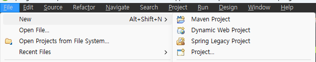
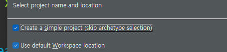
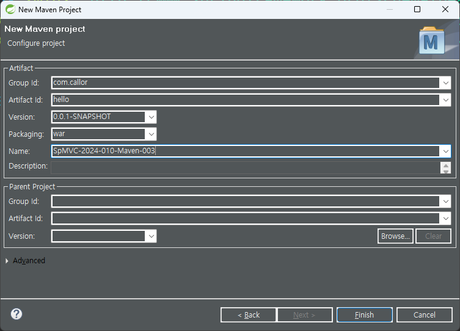
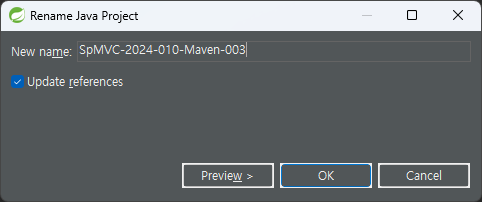
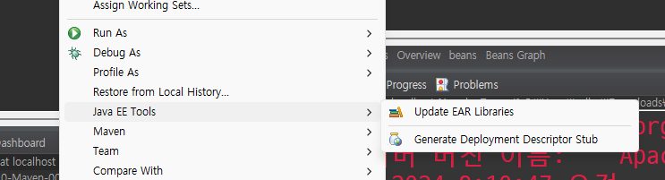
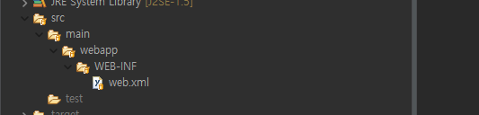
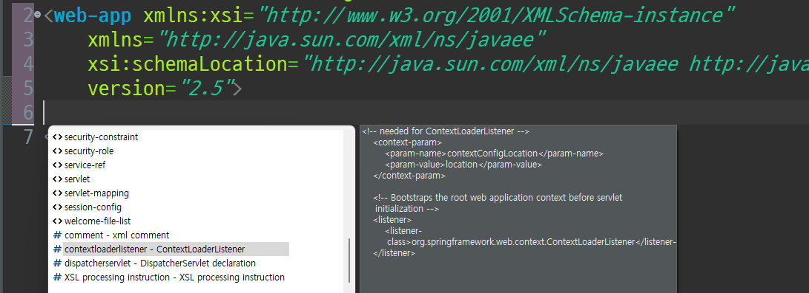

# maven project 로 Spring Legacy MVC 프로젝트 생성하기

- `STS 3.9.x` 버전을 다운로드 받는다
- `Spring Bean Configuration File` 생성과 `web.xml` 코드 자동완성을 위하여 `STS 3.9.x` 버전을 사용한다.
- `STS 4.x` 버전은 `Spring Boot` 프로젝트에 특화 되어 있다. 

## maven Project 생성



## Create a simple project(Skip archetype selection) 체크 하고 next



## 프로젝트 설정



- Group id, Artifact id, base-package 로설정
- Packaging : war 로 설정

## 프로젝트 이름 변경



- 프로젝트에서 F2 를 눌러 적당한 이름으로 변경

## Web Application 으로 변경



- 프로젝트 이름 우클릭 / Java EE Tools / Generated Deployment stub 선택
- /wepapp/WEB-INF/web.xml 파일 생성되는지 확인
  

- web.xml 파일에서 다음 항목만 남기고 모두 삭제

```xml
<?xml version="1.0" encoding="UTF-8"?>
<web-app xmlns:xsi="http://www.w3.org/2001/XMLSchema-instance"
	xmlns="http://java.sun.com/xml/ns/javaee"
	xsi:schemaLocation="http://java.sun.com/xml/ns/javaee http://java.sun.com/xml/ns/javaee/web-app_2_5.xsd"
	version="2.5">

</web-app>
```

## Spring Context 설정

- web.xml 의 `<web-app> </web-app>` 간격에서 `Ctrl + Space` 눌러 Context 메뉴 열기
  

- 자동완성 기능을 이용하여 다음 코드 생성

```xml
<?xml version="1.0" encoding="UTF-8"?>
<web-app xmlns:xsi="http://www.w3.org/2001/XMLSchema-instance"
	xmlns="http://java.sun.com/xml/ns/javaee"
	xsi:schemaLocation="http://java.sun.com/xml/ns/javaee http://java.sun.com/xml/ns/javaee/web-app_2_5.xsd"
	version="2.5">
<!-- needed for ContextLoaderListener -->
	<context-param>
		<param-name>contextConfigLocation</param-name>
		<param-value>location</param-value>
	</context-param>

	<!-- Bootstraps the root web application context before servlet initialization -->
	<listener>
		<listener-class>org.springframework.web.context.ContextLoaderListener</listener-class>
	</listener>
	<!-- The front controller of this Spring Web application, responsible for handling all application requests -->
	<servlet>
		<servlet-name>springDispatcherServlet</servlet-name>
		<servlet-class>org.springframework.web.servlet.DispatcherServlet</servlet-class>
		<init-param>
			<param-name>contextConfigLocation</param-name>
			<param-value>location</param-value>
		</init-param>
		<load-on-startup>1</load-on-startup>
	</servlet>

	<!-- Map all requests to the DispatcherServlet for handling -->
	<servlet-mapping>
		<servlet-name>springDispatcherServlet</servlet-name>
		<url-pattern>url</url-pattern>
	</servlet-mapping>

</web-app>
```

- 완성된 코드를 편집하여 다음 사항만 남기고 삭제,
- `servlet-name` 이름을 `dispatcher` 변경

```xml
<?xml version="1.0" encoding="UTF-8"?>
<web-app xmlns:xsi="http://www.w3.org/2001/XMLSchema-instance"
	xmlns="http://java.sun.com/xml/ns/javaee"
	xsi:schemaLocation="http://java.sun.com/xml/ns/javaee http://java.sun.com/xml/ns/javaee/web-app_2_5.xsd"
	version="2.5">

	<!-- Bootstraps the root web application context before servlet initialization -->
	<listener>
		<listener-class>org.springframework.web.context.ContextLoaderListener</listener-class>
	</listener>
	<!-- The front controller of this Spring Web application, responsible for handling all application requests -->
	<servlet>
		<servlet-name>dispatcher</servlet-name>
		<servlet-class>org.springframework.web.servlet.DispatcherServlet</servlet-class>
		<load-on-startup>1</load-on-startup>
	</servlet>

	<!-- Map all requests to the DispatcherServlet for handling -->
	<servlet-mapping>
		<servlet-name>dispatcher</servlet-name>
		<url-pattern>url</url-pattern>
	</servlet-mapping>

</web-app>
```

## Context.xml 파일 생성

- `/WEB-INF` 폴더에서 `file/new/spring bean configuration` 선택하여
- `applicationContext.xml`,`dispatcher-servlet.xml` 파일 생성

## pom.xml 파일 수정

- `pom.xml` 파일을 수정하여 `properties`, `dependencies`, `build` 항목을 다음과 같이 추가
- `프로젝트 우클릭/Maven/Update project` 실행

```xml
<project xmlns="http://maven.apache.org/POM/4.0.0"
	xmlns:xsi="http://www.w3.org/2001/XMLSchema-instance"
	xsi:schemaLocation="http://maven.apache.org/POM/4.0.0 https://maven.apache.org/xsd/maven-4.0.0.xsd">
	<modelVersion>4.0.0</modelVersion>
	<groupId>com.callor</groupId>
	<artifactId>hello</artifactId>
	<version>0.0.1-SNAPSHOT</version>
	<packaging>war</packaging>
	<name>hello</name>

	<properties>
		<java-version>11</java-version>
		<org.springframework-version>5.2.25.RELEASE</org.springframework-version>
	</properties>
	<dependencies>
		<dependency>
			<groupId>org.springframework</groupId>
			<artifactId>spring-webmvc</artifactId>
			<version>${org.springframework-version}</version>
		</dependency>
		<!-- Servlet -->
		<dependency>
			<groupId>org.apache.tomcat</groupId>
			<artifactId>tomcat-jsp-api</artifactId>
			<version>9.0.87</version>
		</dependency>

		<dependency>
			<groupId>javax.servlet.jsp</groupId>
			<artifactId>jsp-api</artifactId>
			<version>2.2</version>
			<scope>provided</scope>
		</dependency>

		<!-- https://mvnrepository.com/artifact/javax.servlet/jstl -->
		<dependency>
			<groupId>javax.servlet</groupId>
			<artifactId>jstl</artifactId>
			<version>1.2</version>
		</dependency>
	</dependencies>
	<build>
		<plugins>
			<plugin>
				<artifactId>maven-eclipse-plugin</artifactId>
				<version>2.9</version>
			</plugin>
			<plugin>
				<groupId>org.apache.maven.plugins</groupId>
				<artifactId>maven-compiler-plugin</artifactId>
				<version>3.8.1</version>
				<configuration>
					<source>${java-version}</source>
					<target>${java-version}</target>
				</configuration>
			</plugin>
		</plugins>
	</build>
</project>
```

## index.jsp 만들기

- `/src/main/webapp` 폴더에 `jsp` 파일 만들기

```jsp
<%@ page language="java" contentType="text/html; charset=UTF-8"
	pageEncoding="UTF-8"%>

<!DOCTYPE html>
<html>
  <head>
  <meta charset="UTF-8">
  <meta name="viewport" content="width=device-width, initial-scale=1.0">
  <title>Insert title here</title>
</head>
<body>
	<h1>Hello</h1>

</body>
</html>
```

## 서버 실행하여 테스트

- `프로젝트 우클릭/Run As/Run On Server` 선택하여 서버 실행
- `웹브라우저`에서 `http://localhost:8080/hello` 주소 입력하여 `Hello` 문자 보이는지 확인
